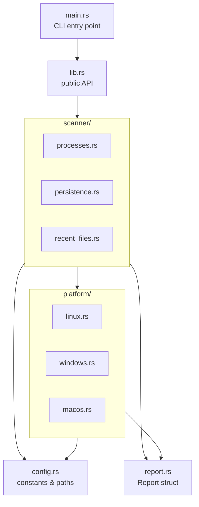
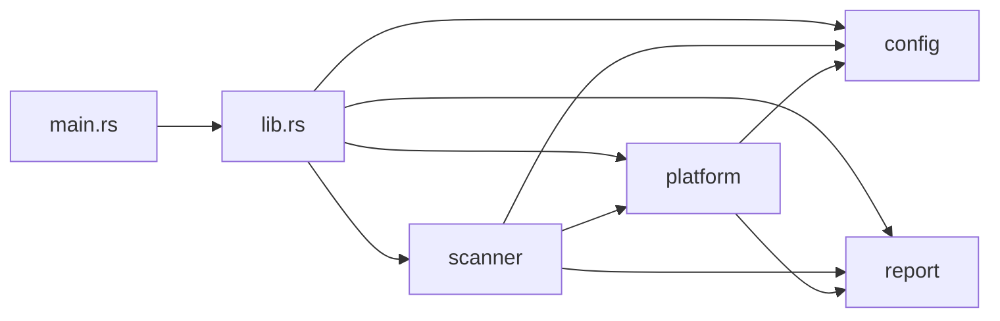
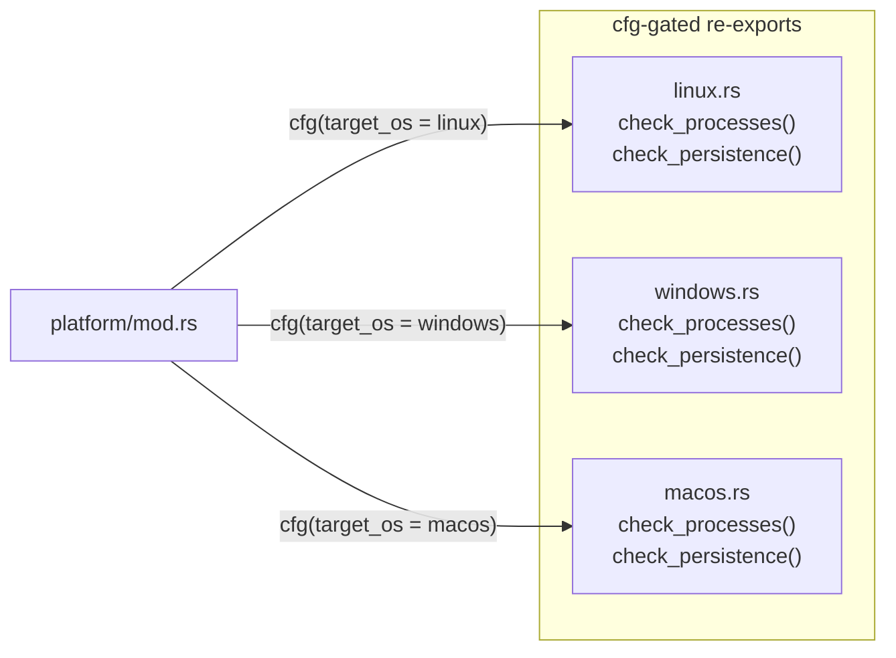
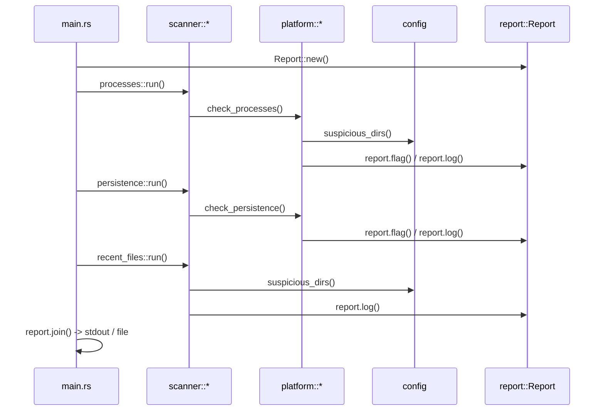

# Sentrix

A lightweight, cross-platform (Linux / Windows / macOS) heuristic malware
triage scanner, written in Rust with minimal dependencies.

> **NOT a full antivirus.** No signature database, no cloud lookups, no
> quarantine or removal. It flags things worth a human looking at.

---

## Table of Contents

- [Overview](#overview)
- [Architecture](#architecture)
  - [High-Level Flow](#high-level-flow)
  - [Module Dependency Graph](#module-dependency-graph)
  - [Platform Dispatch](#platform-dispatch)
  - [Scan Lifecycle](#scan-lifecycle)
- [Project Structure](#project-structure)
- [What It Checks](#what-it-checks)
- [Build](#build)
- [Usage](#usage)
- [Configuration](#configuration)
- [Adding a New Check](#adding-a-new-check)
- [Adding a New Platform](#adding-a-new-platform)
- [Testing](#testing)
- [Limitations](#limitations)
- [Roadmap](#roadmap)
- [License](#license)

---

## Overview

Sentrix performs automated heuristic triage on a running system. It
inspects processes, persistence mechanisms, and recently modified files to
surface indicators that may warrant manual investigation.

**Design principles:**

| Principle | Detail |
|-----------|--------|
| Zero runtime deps | std only; `winreg` on Windows for registry access |
| Cross-platform | Linux, Windows, macOS from a single codebase |
| No side-effects | Read-only scanner; never modifies the system |
| Modular | Each check is an isolated, testable unit |
| Library + Binary | `lib.rs` exposes a reusable API; `main.rs` is the CLI |

---

## Architecture

### High-Level Flow



### Module Dependency Graph



**Dependency rules:**

- `config` and `report` are leaf modules — they depend on nothing internal.
- `platform` depends on `config` and `report`.
- `scanner` depends on `platform`, `config`, and `report`.
- `main.rs` depends on everything via `lib.rs`.

### Platform Dispatch

The `platform/mod.rs` uses `#[cfg]` attributes so only the active OS module
compiles. Each platform module exports the same public interface:



Only **one** platform module is ever compiled into the binary.

### Scan Lifecycle



---

## Project Structure

```
Sentrix/
├── Cargo.toml                        # Package metadata, targets, deps
├── README.md
├── .gitignore
├── src/
│   ├── main.rs                       # CLI entry point, arg parsing
│   ├── lib.rs                        # Library root — public API
│   ├── config.rs                     # Suspicious dirs, patterns, constants
│   ├── report.rs                     # Report struct + output formatting
│   ├── scanner/
│   │   ├── mod.rs                    # Scanner module root
│   │   ├── processes.rs              # Process location checks
│   │   ├── persistence.rs            # Persistence mechanism checks
│   │   └── recent_files.rs           # Recently modified file checks
│   └── platform/
│       ├── mod.rs                    # cfg-gated re-exports
│       ├── linux.rs                  # /proc, cron, shell rc
│       ├── windows.rs                # tasklist, registry Run keys
│       └── macos.rs                  # ps, LaunchAgents/Daemons
└── tests/
    └── integration.rs                # Integration tests
```

---

## What It Checks

| Check | Linux | Windows | macOS |
|-------|-------|---------|-------|
| Suspicious process locations | `/proc/*/exe` from `/tmp`, `/dev/shm`, `/var/tmp` | `wmic` with full `ExecutablePath` (tasklist fallback) | `ps -axo pid,args` with full executable paths |
| Deleted-but-running binaries | `(deleted)` in `/proc/*/exe` | — | — |
| Persistence — cron | `/etc/crontab`, `/etc/cron.d/*` | — | `/etc/crontab`, `/etc/cron.d/*`, per-user `crontab -l` |
| Persistence — shell rc | `.bashrc`, `.profile` download-exec patterns | — | `.zshrc`, `.bash_profile`, `.zprofile` download-exec patterns |
| Persistence — registry | — | `HKCU`/`HKLM` `Run` + `RunOnce` keys | — |
| Persistence — scheduled tasks | — | `schtasks /query` with action pattern matching | — |
| Persistence — launch agents | — | — | On-disk plist scan + `launchctl list` cross-reference |
| Persistence — startup folder | — | `AppData\Roaming\...\Startup` directory scan | — |
| Persistence — WMI events | — | WMI `__EventConsumer` command pattern matching | — |
| Persistence — services | — | `wmic service` path pattern matching | — |
| Persistence — kernel extensions | — | — | `/Library/Extensions`, `/System/Library/Extensions` scan |
| Persistence — PowerShell script blocks | — | `Get-WinEvent` with `Microsoft-Windows-PowerShell/Operational` log | — |
| Persistence — network extensions | — | — | `/Library/SystemExtensions`, `/Library/NetworkExtensions` scan |
| Recently modified files | `/tmp`, `/dev/shm`, `/var/tmp` | `%LOCALAPPDATA%\Temp`, `C:\Users\Public` | `/tmp`, `/var/tmp`, `/private/tmp`, `/Users/Shared` |

**Suspicious patterns detected in persistence entries:**

- Windows: `powershell`, `cmd /c`, `mshta`, `certutil`, temp/public paths (registry + scheduled tasks + services + WMI)
- macOS: `curl`, `wget`, `/tmp/`, `base64` in plist files, crontab entries, and shell rc files
- Linux: `curl|bash`, `wget|sh`, `base64 -d`, `/dev/tcp/` in shell rc files

---

## Build

Requires **Rust 1.70+** ([install via rustup](https://rustup.rs)).

```bash
cargo build --release
```

Output binary:
- Linux/macOS: `target/release/Sentrix`
- Windows: `target\release\Sentrix.exe`

### Cross-Compilation

Build natively on each target OS, or cross-compile:

```bash
# Example: build for Windows from Linux
rustup target add x86_64-pc-windows-gnu
cargo build --release --target x86_64-pc-windows-gnu
```

---

## Usage

```
./Sentrix                     # full scan, prints to stdout
./Sentrix --quick             # skip the recent-file-modification pass
./Sentrix --out report.txt    # write report to file
./Sentrix --config custom.toml  # use custom detection patterns
```

**Privileges:**
- **Windows:** Run from an elevated (Administrator) terminal for full registry access.
- **macOS/Linux:** `sudo` to access root-owned paths you'd otherwise miss.

---

## Configuration

All tunable constants live in `src/config.rs` and can be overridden via a TOML configuration file.

| Constant | Description | Default |
|----------|-------------|---------|
| `RECENT_FILE_DAYS` | How many days back to scan for modified files | `3` |
| `suspicious_dirs()` | Platform-specific list of temp/suspicious directories | per-OS |
| `SUSPICIOUS_AUTORUN_PATTERNS` | Windows registry value patterns to flag | 6 patterns |
| `SUSPICIOUS_TASK_ACTIONS` | Windows scheduled task action patterns to flag | 7 patterns |
| `SUSPICIOUS_POWERSHELL_PATTERNS` | PowerShell script block patterns to flag | 18 patterns |
| `SUSPICIOUS_PLIST_PATTERNS` | macOS plist content patterns to flag | 4 patterns |
| `SUSPICIOUS_CRON_PATTERNS` | macOS crontab entry patterns to flag | 4 patterns |
| `SUSPICIOUS_LAUNCHCTL_OUTPUT` | macOS launchctl label patterns to flag | 6 patterns |
| `SHELL_RC_FILES` | Linux shell rc files to inspect | `.bashrc`, `.profile` |
| `PERSISTENCE_SCAN_DIRS` | Linux dirs to scan for recent modifications | `/etc`, `/usr/local/bin` |

### Custom Configuration File

Create a TOML file with your custom patterns and pass it via `--config`:

```bash
./Sentrix --config /path/to/custom.toml
```

See `sentrix.example.toml` for the full configuration format with all available options.

---

## Adding a New Check

1. **Create** `src/scanner/new_check.rs` with a `pub fn run(report: &mut Report)`.
2. **Register** it in `src/scanner/mod.rs`: `pub mod new_check;`.
3. If platform-specific, add implementation in `src/platform/{linux,windows,macos}.rs`.
4. **Call** it from `src/main.rs` in the scan sequence.
5. **Add** constants to `src/config.rs` if needed.
6. **Write tests** in `tests/integration.rs`.

```rust
// src/scanner/new_check.rs
use crate::report::Report;
use crate::platform;

pub fn run(report: &mut Report) {
    platform::check_new_thing(report);
}
```

---

## Adding a New Platform

1. **Create** `src/platform/newplatform.rs` exporting:
   - `pub fn check_processes(report: &mut Report)`
   - `pub fn check_persistence(report: &mut Report)`
2. **Add cfg gate** in `src/platform/mod.rs`:
   ```rust
   #[cfg(target_os = "newplatform")]
   mod newplatform;
   #[cfg(target_os = "newplatform")]
   pub use newplatform::*;
   ```
3. **Add** platform-specific paths to `src/config.rs`.

---

## Testing

```bash
cargo test            # run all tests
cargo test -- --nocapture  # show println! output
```

**Current status:** `tests/integration.rs` exists but is not yet populated.
Planned test coverage:

- `Report` struct behavior (section, flag, log)
- Config output (suspicious dirs not empty, constants correct)
- Scanner edge cases (nonexistent directories, empty files, permission errors)
- One test per suspicious pattern in `config.rs` to guard against regressions

See [docs/PROGRESS.md](docs/PROGRESS.md#6-test-coverage) for full status.

---

## Limitations

- **No real-time monitoring** — single-shot scan only.
- **No signature scanning** — heuristic only, will miss known malware without suspicious indicators.
- **No remediation** — reports findings, never removes/quarantines.
- **No elevated by default** — needs `sudo`/Admin for full visibility.
- **No CI** — cross-platform compilation is not yet verified by automated testing (see [Roadmap](#roadmap) #1).
- **No structured output** — plain text only, no JSON/SARIF (see [Roadmap](#roadmap) #5).
- **Tests not yet implemented** — `tests/integration.rs` is a stub (see [Roadmap](#roadmap) #6).

---

## Roadmap

| Priority | Item | Status |
|----------|------|--------|
| 1 | CI (`cargo build`/`test`/`clippy`/`fmt` on all 3 OSes) | Not started |
| 2 | Example output in README | Not started |
| 3 | Windows/macOS parity (schtasks, launchctl, WMI) | ✅ Complete |
| 4 | Configurable detection patterns (external TOML/YAML) | ✅ Complete |
| 5 | Structured output (`--json`, severity levels) | Not started |
| 6 | Test coverage (unit tests, tarpaulin/grcov, badge) | Not started |
| 7 | Nice-to-haves (`--diff`, `CONTRIBUTING.md`) | Not started |

See [docs/PROGRESS.md](docs/PROGRESS.md#roadmap-status) for detailed status,
gaps, and implementation notes for each item.

---

## License

MIT
