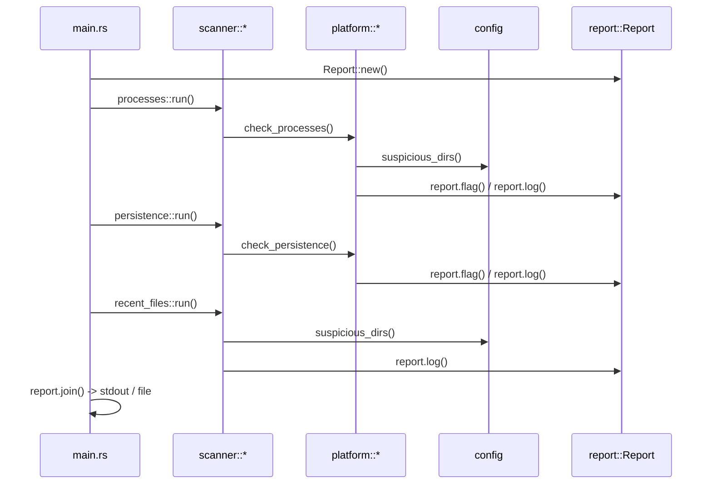

# Architecture

This document explains the architectural decisions behind Sentrix's design,
why each choice was made, and how the pieces fit together.

---

## Why a Library + Binary Split?

```
src/lib.rs   → exposes the public API
src/main.rs  → thin CLI wrapper
```

**Why:** A single `main.rs` ties the logic to the CLI. Splitting into
`lib.rs` + `main.rs` means:

- Other Rust programs can import `sentrix` as a dependency and call scan
  functions programmatically (e.g., a CI pipeline, a daemon, a GUI wrapper).
- `main.rs` stays under ~50 lines — it only handles arg parsing, orchestration,
  and output routing.
- Testing is easier — you test the library, not the CLI.

This is standard Rust practice for any non-trivial binary crate.

---

## Why Separate `config.rs`?

All magic strings, path constants, and pattern lists live in `config.rs`.

**Why:** In the original monolithic code, paths like `"/tmp"`, `"/dev/shm"`,
and patterns like `"powershell -enc"` were scattered across functions. This
made them hard to find, hard to change, and easy to miss when adding a new
platform.

Centralizing them means:

- A single place to audit what the tool looks for.
- Easy to tune without touching scan logic.
- Constants can be `#[cfg]`-gated per platform without polluting scan code.

---

## Why Separate `report.rs`?

The `Report` struct and its formatting logic are isolated from scan logic.

**Why:** The report is the tool's only output. By isolating it:

- Scan modules only call `report.log()` and `report.flag()` — they don't
  care about formatting, file I/O, or output routing.
- Adding new output formats (JSON, SARIF, XML) only touches `report.rs`,
  not every scanner.
- The `Report` struct is reusable across any caller (library consumers,
  tests, CLI).

---

## Why a `platform/` Directory?

Platform-specific code is isolated into `linux.rs`, `windows.rs`, `macos.rs`,
gated by `#[cfg]` in `platform/mod.rs`.

**Why:** The original code had `#[cfg]` blocks scattered throughout a single
file. This created several problems:

1. **Readability** — Linux, Windows, and macOS logic was interleaved,
   making it hard to follow any single platform's flow.
2. **Maintainability** — Editing Linux code required scrolling past
   unrelated Windows/macOS blocks.
3. **Compile errors** — A typo in a Windows-only block could break the
   Linux build if the `#[cfg]` gate was wrong.

The `platform/` module solves this:

```
platform/
├── mod.rs        ← cfg-gated re-exports (only one compiles)
├── linux.rs      ← all Linux-specific code
├── windows.rs    ← all Windows-specific code
└── macos.rs      ← all macOS-specific code
```

Each platform module exports the **same public interface**:

- `check_processes(report: &mut Report)`
- `check_persistence(report: &mut Report)`

This is the **Strategy pattern** via compile-time dispatch. The scanner
modules don't know or care which platform they're on — they just call
`platform::check_processes()` and the right implementation is linked.

---

## Why a `scanner/` Directory?

Scanner modules (`processes`, `persistence`, `recent_files`) sit between
the CLI and the platform layer.

**Why:** This is the **orchestration layer**. Each scanner module:

1. Receives a `&mut Report`.
2. Delegates to the appropriate `platform::*` function.
3. Optionally adds shared logic (e.g., `recent_files` is cross-platform).

This separation means:

- Adding a new scan type = new file in `scanner/`, one function call in
  `main.rs`. No other files change.
- Scanner modules are thin — they don't contain platform-specific logic.
- The scan sequence is explicit in `main.rs`:

```rust
scanner::processes::run(&mut report);
scanner::persistence::run(&mut report);
scanner::recent_files::run(&dirs, 3, &mut report);
```

---

## Module Dependency Graph

```
main.rs ──→ lib.rs ──→ config.rs     (leaf — no internal deps)
                   ├──→ report.rs    (leaf — no internal deps)
                   ├──→ platform/    ← depends on config, report
                   └──→ scanner/     ← depends on platform, config, report
```

**Rules enforced by this structure:**

| Module | Can depend on | Cannot depend on |
|--------|--------------|-----------------|
| `config` | std only | nothing internal |
| `report` | std only | nothing internal |
| `platform` | `config`, `report` | `scanner`, `main` |
| `scanner` | `platform`, `config`, `report` | `main` |
| `main` | everything via `lib` | — |

This is a strict layered architecture. Dependencies flow one direction.
No circular imports between layers.

> **Note:** `platform` and `scanner` have a practical coupling —
> `platform::check_persistence()` calls `scanner::recent_files::run()`.
> This is acceptable because `recent_files` is pure shared logic with no
> platform dependency. In a stricter design, `recent_files` would live in
> a `util/` module.

---

## Why No External Dependencies?

The only dependency is `winreg` on Windows. Everything else uses `std`.

**Why:**

- **Security tooling must be auditable.** Fewer deps = smaller attack surface.
- **Binary size.** `opt-level = "z"` + `lto = true` + `strip = true` in
  the release profile produces a tiny binary.
- **Cross-compilation.** No C deps, no build scripts, no cmake — just
  `cargo build --target <triple>`.
- **Trust.** Supply-chain attacks target dependency trees. A near-zero
  dep tree is a feature.

The tradeoff is more code (e.g., manual timestamp formatting instead of
`chrono`), but for a triage tool this is acceptable.

---

## Why `Report` Uses `Vec<String>` Instead of Structured Data?

Findings are stored as formatted strings, not as structured enums/structs.

**Why (for now):** The original design was a simple text reporter. This
was kept for v0.1.0 to avoid over-engineering before the check set is
stable.

**Future improvement:** Once the check set stabilizes, `Report` should use
structured findings:

```rust
enum Severity { Info, Warning, Critical }

struct Finding {
    severity: Severity,
    category: String,
    message: String,
    source: String,
}
```

This enables JSON/SARIF output, filtering by severity, and programmatic
consumption. The current string-based approach is a placeholder.

> **Roadmap:** Structured output (`--json`) is tracked as priority #5 in
> [PROGRESS.md](PROGRESS.md#5-structured-output---json). The `Severity`
> enum and `Finding` struct shown above are the planned implementation.

---

## Scan Lifecycle



The flow is strictly linear. No parallelism, no async. This is intentional —
a triage scanner should be predictable and debuggable.

---

## Key Design Decisions Summary

| Decision | Rationale |
|----------|-----------|
| Lib + Bin split | Reusable API, testable, standard Rust practice |
| `config.rs` centralization | Single source of truth for paths and patterns |
| `platform/` with `#[cfg]` | Clean compile-time platform dispatch |
| `scanner/` orchestration | Thin layer, easy to add/remove checks |
| Zero deps (except `winreg`) | Security, auditability, tiny binary |
| String-based `Report` | Simplicity for v0.1.0, structured later |
| Linear scan flow | Predictable, debuggable, no concurrency bugs |
